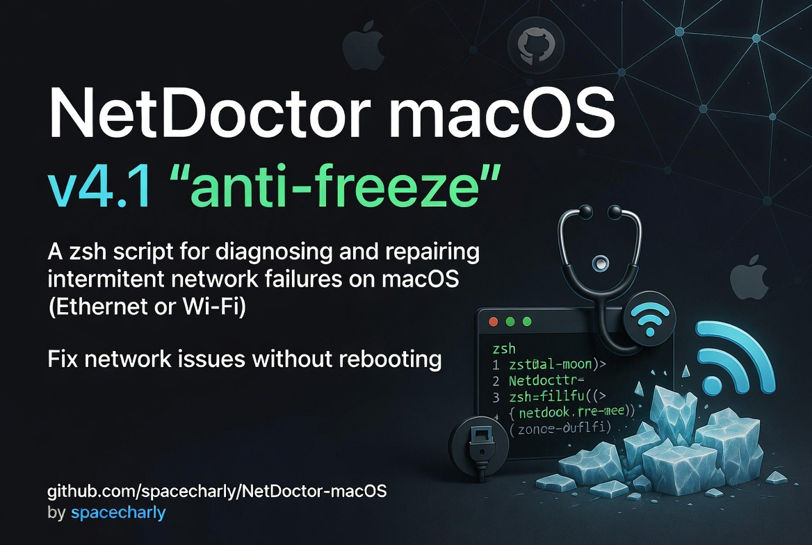

<p align="center">
  <a href="https://github.com/spacecharly/NetDoctor-macOS" target="_blank" rel="noopener noreferrer">
    
  </a>
</p>

# NetDoctor macOS — v4.1 "anti-freeze"

A `zsh` script for diagnosing and repairing intermittent network failures on macOS (Ethernet or Wi-Fi).  
Designed for cases where a simple interface reset is not enough and you would otherwise have to reboot.

---

## Features

- **Progressive repair strategy** — avoids breaking a partially working stack
- **Strict timeouts** on every blocking call (no frozen terminal)
- **Automatic rollback** — restores the last known IP if a repair makes things worse
- **Smart failure classification**:
  - Physical layer issue (cable / adapter / switch)
  - DHCP / `configd` failure (link up, no IP)
  - TLS / proxy / trust issue (IP works, HTTPS fails)
- **HTTPS-only repair path** — skips L2 reset when IP/gateway/DNS are healthy
- **Full diagnostic bundle export** — compressed `.tar.gz` with `ifconfig`, `scutil`, `netstat`, `log show` output, ready to share
- **Persistent logs** → `~/Library/Logs/NetDoctor/`

---

## Files

| File | Description |
|---|---|
| `netdoctor-repair-macos-v4.1.zsh` | Main script |
| `test-netdoctor-v4.1.zsh` | Quick sanity-check harness (no sudo, no network required) |
| `assets/social-preview.jpg` | Versioned local social preview image used at the top of the README |
| `README.md` | This file |

---

## Requirements

- macOS 10.15 Catalina or later (tested on 10.15.x and 12+)
- `zsh` (pre-installed on macOS)
- `sudo` access (only needed for `--repair` / `--deep-repair`)

---

## Installation

```zsh
cd [INSTALL-DIRECTORY]
chmod +x netdoctor-repair-macos-v4.1.zsh
chmod +x test-netdoctor-v4.1.zsh
```

---

## Quick test (no sudo, no network dependency)

```zsh
./test-netdoctor-v4.1.zsh
```

---

## Usage

### Diagnose only (no changes made)

```zsh
./netdoctor-repair-macos-v4.1.zsh
```

### Standard repair

```zsh
./netdoctor-repair-macos-v4.1.zsh --repair
```

### Deep repair (restarts OS network daemons — `configd`, `mDNSResponder`)

```zsh
./netdoctor-repair-macos-v4.1.zsh --deep-repair
```

### Force Ethernet transport

```zsh
./netdoctor-repair-macos-v4.1.zsh --repair --transport ethernet
```

### Force a specific interface and service name

```zsh
./netdoctor-repair-macos-v4.1.zsh --repair --interface en0 --service "USB 10/100/1000 LAN"
```

### Full example with verbose output

```zsh
./netdoctor-repair-macos-v4.1.zsh --deep-repair --transport any --verbose
```

---

## Options

| Option | Description |
|---|---|
| `--repair` | Apply standard automated repair if checks fail |
| `--deep-repair` | Standard repair + OS daemon restart |
| `--transport TYPE` | `auto` \| `ethernet` \| `wifi` \| `any` (default: `auto`) |
| `--interface IFACE` | Force network interface (e.g. `en0`, `en7`) |
| `--service NAME` | Force network service name (e.g. `"USB 10/100/1000 LAN"`) |
| `--verbose` | Print command outputs where possible |
| `-h`, `--help` | Show inline help |

---

## Repair strategy

```
run_all_checks
    └─ all OK → exit 0

    └─ HTTPS fails, IP/GW/DNS/Internet OK
           → repair_https_only (flush DNS, sync clock, reset IPv6, clear proxies, kick trustd)
           → re-check → OK → exit 0
           → still failing + --deep-repair → repair_deep → re-check

    └─ no IP or no gateway
           → repair_standard (interface down/up, DHCP NONE→DHCP, service bounce)
           → maybe_rollback (restores last IP if we made things worse)
           → re-check → OK → exit 0
           → still failing + --deep-repair → repair_deep → re-check

    └─ all attempts failed
           → export_bundle (.tar.gz in ~/Library/Logs/NetDoctor/)
           → exit 1
```

---

## Failure patterns

| What you see | Likely cause |
|---|---|
| `Internet IP OK` + `HTTPS failed` | Bad system date/time, IPv6 stack issue, proxy, TLS trust |
| `Link active` + `No local IP` | DHCP failure, `configd` issue |
| `Link inactive` | Cable, adapter, switch port, router |
| `Local IP` + `No gateway` | Router issue, bad static config |

---

## Logs & diagnostic bundle

Every run writes a log to:

```
~/Library/Logs/NetDoctor/netdoctor-YYYYMMDD-HHMMSS.log
```

When checks fail, a full diagnostic bundle is exported:

```
~/Library/Logs/NetDoctor/bundle-YYYYMMDD-HHMMSS/
    network-state.txt       ← ifconfig, route, scutil --dns, scutil --proxy, networksetup
    macos-log-network.txt   ← last 5 min of macOS unified log (network subsystem)
    macos-log-configd.txt   ← last 5 min of configd / mDNSResponder activity
    netstat-iface.txt       ← per-interface packet stats
    session.log             ← copy of this run's log

~/Library/Logs/NetDoctor/netdoctor-bundle-YYYYMMDD-HHMMSS.tar.gz
```

To find the latest bundle:

```zsh
ls -t ~/Library/Logs/NetDoctor/*.tar.gz | head -n 1
```

---

## License

MIT
